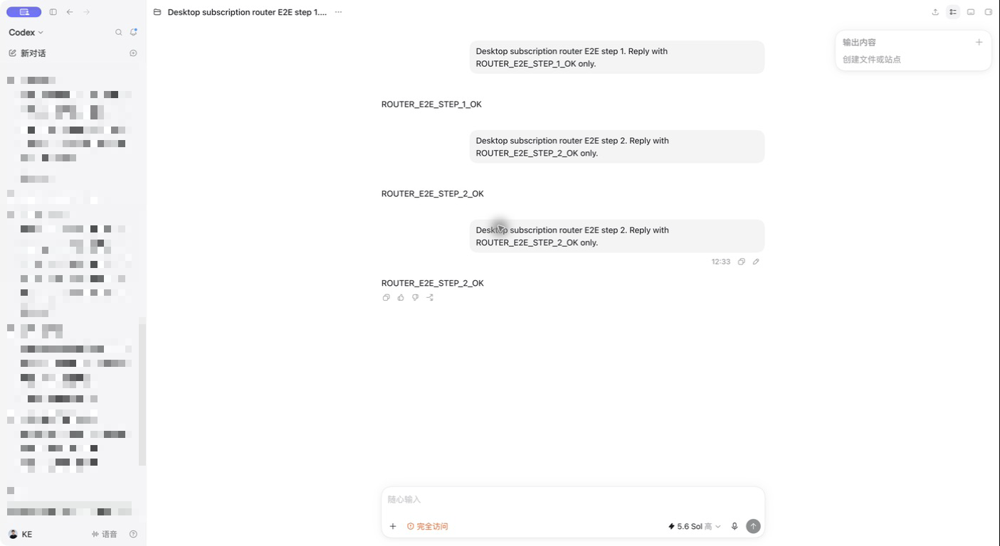
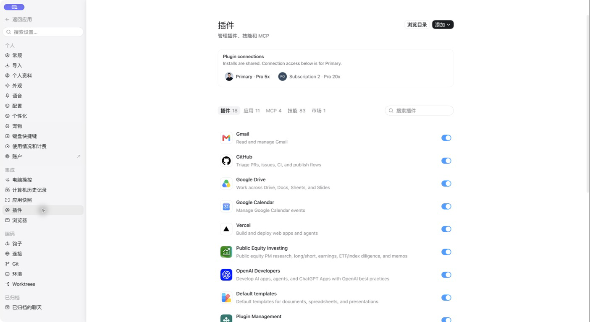

# Codex Subscription Router

**简体中文** | [English](README.en.md)



> 这是本 fork 的真实 Desktop E2E 截图。左侧项目和任务名称已做不可读的像素马赛克；中央路由测试内容未做内容编辑。

在一个独立的 macOS Desktop 应用里，同时使用多个 ChatGPT 订阅。

Codex Subscription Router 会基于官方 ChatGPT.app 创建一份本地独立副本，为每个订阅启动隔离的 Codex 后端，并根据额度情况给新对话分配账号。同一线程会持续使用原账号；当该账号额度耗尽时，Router 会迁移完整会话历史并自动切换到仍有额度的订阅。

官方 `/Applications/ChatGPT.app` 只作为构建输入，安装过程不会修改它。本仓库仅包含源代码和构建工具，不分发 OpenAI 二进制文件或预构建应用。

> [!WARNING]
> 这是一个非官方、依赖特定 ChatGPT Desktop 版本的项目，与 OpenAI 没有隶属或支持关系。请自行审阅代码，并确保使用方式符合每个订阅适用的条款。

## 核心能力

- **额度感知路由：** 新对话会优先使用即将重置、需要及时消耗的周额度，并兼顾短周期压力和已储存的 usage reset。
- **线程粘性：** 线程一旦分配给某个订阅，后续消息会持续回到该账号，保留上下文和账号级缓存收益。
- **自动故障转移：** 当前账号耗尽时，会话历史会迁移到另一个仍有额度的账号，并在同一线程继续。
- **原生账号管理：** 现有个人资料菜单显示汇总额度、头像、套餐、掩码邮箱，并支持添加订阅。
- **账号感知设置：** 个人资料统计支持汇总或单账号查看；插件页可切换不同订阅的 Apps 与 MCP 连接状态。
- **独立 macOS 权限：** Router.app 和 Computer Use helper 拥有独立 bundle identity 与签名，可获得自己的隐私权限。

## 工作原理

Desktop 前端仍然只建立一条 app-server 连接。一个小型 Go multiplexer 把请求分发给每个账号对应的官方 Codex child process；每个次账号拥有隔离的 Codex home，Router 持久记录每个线程的所有者。

```text
Codex Subscription Router.app
        │
        │ 一条 app-server 连接
        ▼
    codex-mux
    ├── Primary        → ~/.codex
    ├── Subscription 2 → 独立 Codex home
    └── Subscription 3 → 独立 Codex home
             │
             └── thread ID → 持久账号归属
```

新线程会比较各账号在周额度重置前需要消耗的速度，并加入有上限的 reset credits 权重。短周期使用率、已置顶线程数量和稳定账号顺序用于打破接近结果。已有线程不会因为普通负载均衡而频繁迁移。

详细请求流程见 [架构说明](docs/ARCHITECTURE.md)，信任边界见 [安全模型](docs/SECURITY-MODEL.md)。

## 兼容性

当前 fork 已实机验证：

| 组件 | 支持值 |
| --- | --- |
| 平台 | Apple silicon Mac |
| 官方 ChatGPT 版本 | `26.818.41509` |
| 官方 bundle build | `6962` |
| Go | 1.26 或更高 |
| Node.js | 22.12 或更高 |

Patcher 会在修改前核对官方版本、build、ASAR 哈希、renderer anchors 和原生二进制常量。遇到未知上游版本时会直接停止，避免生成部分打补丁的应用。记录的哈希和测试细节见 [兼容性说明](docs/COMPATIBILITY.md)。

## 安装要求

- `/Applications/ChatGPT.app` 已安装
- Xcode Command Line Tools
- Go 1.26+
- Node.js 22.12+ 与 npm
- Apple Development 或 Developer ID Application 签名身份

Appshots 和 Computer Use 需要团队签名才能稳定复用 macOS 隐私权限。Ad-hoc 签名仅适合诊断。

## 一键安装

下面的命令会下载或更新本 fork、安装锁定的构建依赖、创建独立签名应用并启动：

```sh
curl -fsSL https://raw.githubusercontent.com/kellanxu/codex-subscription-router/main/install.sh | /bin/bash
```

安装器把源码保存在 `~/.codex-subscription-router/source`。重复安装会复用已有账号状态，先创建可恢复备份，并检查签名团队是否连续。缺少依赖或兼容性验证失败时，安装器会明确停止。

> [!TIP]
> 建议先阅读 [`install.sh`](install.sh)，或先下载脚本再执行。

### 交给 Codex 安装

> 在这台 Mac 上安装 `https://github.com/kellanxu/codex-subscription-router`，使用仓库支持的一键安装流程；不要修改官方 ChatGPT.app，也不要删除已有 Router 状态。安装后验证 Router 和 Computer Use helper 的签名并启动应用，仅在缺少依赖或 macOS 权限需要我操作时询问。

### 从 clone 安装

```sh
git clone https://github.com/kellanxu/codex-subscription-router.git
cd codex-subscription-router
npm ci --ignore-scripts
python3 scripts/patch_app.py
open "$HOME/Applications/Codex Subscription Router.app"
```

安装产物：

- `~/Applications/Codex Subscription Router.app`
- `~/Applications/Codex Subscription Router Computer Use.app`
- `~/Library/Application Support/Codex Subscription Router` 下的独立 Desktop profile

Patcher 优先选择 Developer ID Application，找不到时使用 Apple Development。需要指定证书时：

```sh
CODEX_MUX_SIGNING_IDENTITY="Developer ID Application: Example Corp (TEAMID1234)" \
  python3 scripts/patch_app.py
```

每次重建应复用同一个 Apple team。团队变化会改变应用 designated requirement，并可能让已有 macOS 隐私授权失效。Patcher 默认拒绝意外的团队变化；只有明确传入 `--allow-signing-team-change` 才会继续。

无证书诊断构建：

```sh
python3 scripts/patch_app.py --allow-adhoc-signing
```

Ad-hoc 签名下的 Appshots 和 Computer Use 可能无法工作。

## 授予 macOS 权限

打开 **系统设置 → 隐私与安全性**：

| 权限 | 应用 |
| --- | --- |
| 辅助功能 | Codex Subscription Router |
| 屏幕与系统音频录制 | Codex Subscription Router Computer Use |

macOS 出现 **退出并重新打开** 时按提示操作；没有自动重启时手动打开 Router。如果 Computer Use helper 没出现在列表中，点击加号并选择 `~/Applications/Codex Subscription Router Computer Use.app`。

这份独立构建拥有自己的应用身份和权限记录，请选择 Router 对应的应用与 helper。Computer Use 首次控制其他应用时，macOS 还可能请求 Automation 权限。

## 添加订阅

1. 打开左下角个人资料菜单。
2. 选择 **Add another subscription**。
3. 在浏览器完成显示的 device-code 登录。
4. 返回 Router，等待新账号行出现。

验证码显示期间，点击其他区域不会关闭菜单。点击验证码会复制它并打开验证页面。

个人资料菜单会先显示合并后的周额度，然后为每个订阅显示一行。邮箱默认保持掩码，悬停后才显示；最后一行始终用于继续添加订阅。

## 路由行为

| 场景 | 行为 |
| --- | --- |
| 新对话 | 根据 quota-at-risk、banked resets 与短周期压力分配 |
| 后续消息 | 发往线程持久记录的账号所有者 |
| 所有者额度耗尽 | 迁移历史并由另一个有额度的账号继续 |
| 所有账号耗尽 | 显示合并额度提醒和最近已知重置时间 |
| 账号被禁用 | 排除出路由池和可用额度汇总 |

当前线程所使用的订阅会显示在右上角固定摘要中。

## 个人资料、插件与额度重置

**个人资料统计** 默认显示多账号汇总视图。选择头像可查看单个订阅的身份和统计，再次选择可返回汇总。

**设置 → 插件** 带有订阅选择器。插件定义和托管 MCP 配置共享；Apps、连接状态与 OAuth 登录按当前订阅隔离。

**Rate-limit reset** 继续使用原生界面，并增加账号选择器。选择账号会同步切换余额，并确保 reset 只消耗对应订阅的额度。



## 更新或重建

Router 副本的自动更新器已禁用，避免官方更新覆盖补丁。更新 `/Applications/ChatGPT.app` 后，先确认新版本已列入兼容范围，再执行：

```sh
python3 scripts/patch_app.py --force
```

重建前退出 Router 和 Computer Use helper。已有应用会移动到 `~/.codex-mux/backups` 下的时间戳目录；账号状态和凭据存放在 app bundle 外，会继续保留。新版本通过 smoke test 后，再手动处理旧备份。

每个 macOS 用户都需要单独构建。生成的 bundle 含有用户专属 helper 和 socket 路径，不适合直接搬运或重新分发。

## 本地数据与安全

| 路径 | 用途 |
| --- | --- |
| `~/.codex` | Primary 的凭据、会话与缓存 |
| `~/.codex-mux/state.json` | 账号元数据与线程粘性归属 |
| `~/.codex-mux/accounts/<id>/codex-home` | 次账号隔离数据 |
| `~/.codex-mux/control-token` | loopback 控制服务随机 token |
| `~/.codex-mux/backups` | 可恢复的应用与 helper 备份 |
| `~/Library/Application Support/Codex Subscription Router` | 独立 Desktop profile |

控制服务仅绑定 `127.0.0.1`，私有路由受随机 256-bit token 保护。OAuth token 保留在对应账号的 Codex home 内，不会由控制 API 返回。账号目录仅允许当前用户访问。

插件配置会从 Primary 同步。共享 MCP 配置中的 inline secrets 也会复制到每个隔离账号 home，因此这些账号目录不能视作相互隔离的秘密边界。

凭据、签名或本地控制服务相关问题请先阅读 [SECURITY.md](SECURITY.md)。

## 开发与验证

```sh
npm ci --ignore-scripts
npm run check
npm run release:check
```

Go backend 和注入的 renderer 没有运行时第三方依赖；`@electron/asar` 仅用于构建。确定性的 UI preview route 只有在启动时设置 `CODEX_MUX_UI_TESTS=1` 才会启用，并继续要求 control token。

签名应用测试流程见 [SMOKE-TEST.md](docs/SMOKE-TEST.md)。本 fork 最新完成的真实 Desktop 验证见 [E2E-REPORT-2026-08-25.md](docs/E2E-REPORT-2026-08-25.md)。

## 已知限制

- ChatGPT 上游更新可能需要重新审阅和调整 patch anchors。
- 初始合并历史每个账号最多读取 500 个线程。
- 上游 profile 只返回数量、不返回 skill IDs，因此合并后的“已探索技能”可能重复计数。
- 生成的 app bundle 绑定当前 macOS 用户和签名团队。
- Release 仅包含源码，不分发打补丁后的 OpenAI 二进制文件。

## 贡献与发布

提交改动前请阅读 [CONTRIBUTING.md](CONTRIBUTING.md)。发布流程见 [RELEASING.md](docs/RELEASING.md)，每个 tag 都应对对应 commit 完成签名应用 smoke test。

## 上游与致谢

本仓库 fork 自 [`b-nnett/codex-subscription-router`](https://github.com/b-nnett/codex-subscription-router)。感谢上游作者与贡献者完成原始架构和实现；本 fork 维护额外兼容修复、验证证据、中文文档与实机截图。

## License

项目源码使用 [MIT License](LICENSE)。ChatGPT、Codex 和官方 macOS 应用属于 OpenAI 产品，不包含在该许可证中。
